<div align="center">

# 🏆 Crown-Sourcing Platform
### Sistema Collaborativo per Algoritmi di Pathfinding A*

*Una piattaforma innovativa per la gestione collaborativa di griglie di pathfinding con sistema di token economy*

[](https://nodejs.org/)
[](https://www.typescriptlang.org/)
[](https://www.postgresql.org/)
[](https://www.docker.com/)
[](LICENSE)

</div>

---

## 📋 Indice

- [🎯 **Obiettivo del Progetto**](#-obiettivo-del-progetto)
- [✨ **Caratteristiche Principali**](#-caratteristiche-principali)
- [🏗️ **Architettura del Sistema**](#️-architettura-del-sistema)
- [📊 **Diagrammi UML**](#-diagrammi-uml)
- [🗄️ **Modello Dati (ER)**](#️-modello-dati-er)
- [🚀 **Installazione e Configurazione**](#-installazione-e-configurazione)
- [🔧 **Utilizzo dell'API**](#-utilizzo-dellapi)
- [🧪 **Testing**](#-testing)
- [📚 **Documentazione API**](#-documentazione-api)
- [🤝 **Contribuire**](#-contribuire)
- [📄 **Licenza**](#-licenza)

---

## 🎯 Obiettivo del Progetto

Il **Crown-Sourcing Platform** è un sistema innovativo di **crowd-sourcing** per la gestione collaborativa di griglie utilizzate negli algoritmi di pathfinding A*. La piattaforma implementa un ecosistema completo dove gli utenti possono:

### 🎮 Funzionalità Core
- **🗺️ Creazione Modelli**: Progettare griglie personalizzate per algoritmi di pathfinding
- **🎯 Esecuzione A***: Calcolare percorsi ottimali utilizzando l'algoritmo A* con euristica Manhattan
- **🤝 Collaborazione**: Proporre modifiche collaborative alle griglie esistenti
- **⚖️ Sistema di Approvazione**: Approvare o rifiutare richieste di modifica come creatori
- **👑 Gestione Amministrativa**: Controllo completo di utenti, token e statistiche di sistema

### 💰 Token Economy
Il sistema implementa un'economia basata su **token** che incentiva la partecipazione e garantisce la qualità:
- **Costo Creazione**: 0.05 token per cella della griglia
- **Costo Esecuzione**: Equivalente al costo di creazione del modello
- **Sistema di Ricarica**: Gli amministratori possono gestire i saldi degli utenti
- **Saldo Iniziale**: 20.00 token per ogni nuovo utente

---

## ✨ Caratteristiche Principali

### 🔐 Sistema di Autenticazione
- **JWT Authentication**: Autenticazione sicura basata su token JWT
- **Role-Based Access**: Gestione ruoli (User/Admin) con permessi differenziati
- **Middleware di Sicurezza**: Validazione automatica delle richieste e autorizzazioni

### 🎯 Algoritmo A* Avanzato
- **Libreria astar-typescript**: Implementazione ottimizzata dell'algoritmo A*
- **Euristica Manhattan**: Calcolo efficiente delle distanze
- **Movimento Diagonale**: Supporto per percorsi diagonali
- **Metriche di Performance**: Misurazione tempi di esecuzione

### 🗄️ Gestione Dati Avanzata
- **Pattern DAO**: Separazione logica di accesso ai dati
- **Bulk Operations**: Operazioni ottimizzate per grandi volumi
- **Transaction Management**: Gestione transazioni ACID
- **Paginazione Intelligente**: Navigazione efficiente dei risultati

### 🔧 Architettura Robusta
- **Design Patterns**: Factory, Singleton, DAO, MVC
- **Error Handling**: Gestione centralizzata degli errori
- **Validation Middleware**: Validazione automatica input
- **Database Optimization**: Query ottimizzate e indicizzazione

---

## 🏗️ Architettura del Sistema

Il sistema segue il **pattern MVC (Model-View-Controller)** con un'architettura a livelli ben definita:

```mermaid
graph TB
    subgraph "🌐 Presentation Layer"
        API["🔌 REST API Endpoints"]
        MW["🛡️ Middleware Layer"]
    end
    
    subgraph "🧠 Business Logic Layer"
        AC["👤 Auth Controller"]
        MC["🗺️ Model Controller"]
        UC["🔄 Update Controller"]
        ADC["👑 Admin Controller"]
    end
    
    subgraph "📊 Data Access Layer"
        UD["👥 Utente DAO"]
        MD["🗺️ Modello DAO"]
        RD["📝 Richiesta DAO"]
        CD["🔲 Cella DAO"]
    end
    
    subgraph "🗄️ Data Layer"
        DB[("🐘 PostgreSQL\nDatabase")]
    end
    
    subgraph "🔧 Utilities"
        AST["🎯 A* Algorithm"]
        TW["🔄 Transaction Wrapper"]
        VLD["✅ Validators"]
        ERR["❌ Error Factory"]
    end
    
    API --> MW
    MW --> AC
    MW --> MC
    MW --> UC
    MW --> ADC
    
    AC --> UD
    MC --> MD
    MC --> AST
    UC --> RD
    UC --> CD
    ADC --> UD
    ADC --> MD
    ADC --> RD
    
    UD --> DB
    MD --> DB
    RD --> DB
    CD --> DB
    
    MC --> TW
    UC --> TW
    MW --> VLD
    AC --> ERR
    MC --> ERR
    UC --> ERR
    ADC --> ERR
```



### 🏛️ Componenti Architetturali

#### 🌐 **Presentation Layer**
- **REST API**: Endpoints RESTful per tutte le operazioni
- **Middleware**: Autenticazione, validazione, gestione errori
- **Route Handlers**: Gestione routing e parametri

#### 🧠 **Business Logic Layer**
- **Controllers**: Logica di business e orchestrazione
- **Services**: Servizi specializzati per operazioni complesse
- **Validators**: Validazione business rules

#### 📊 **Data Access Layer**
- **DAO Pattern**: Astrazione accesso dati
- **Models**: Definizione entità e relazioni
- **Repositories**: Gestione query complesse

#### 🗄️ **Data Layer**
- **PostgreSQL**: Database relazionale principale
- **Sequelize ORM**: Mapping oggetto-relazionale
- **Migrations**: Gestione schema database

---

## 📊 Diagrammi UML

### 🎭 Diagramma dei Casi d'Uso

```mermaid
graph LR
    subgraph "👤 Attori"
        U["🧑‍💻 Utente"]
        A["👑 Amministratore"]
    end
    
    subgraph "🎯 Sistema Crown-Sourcing"
        subgraph "🔐 Autenticazione"
            UC1["📝 Registrazione"]
            UC2["🔑 Login"]
        end
        
        subgraph "🗺️ Gestione Modelli"
            UC3["➕ Crea Modello"]
            UC4["🎯 Esegui A*"]
            UC5["📊 Visualizza Modelli"]
            UC6["📈 Stato Modello"]
        end
        
        subgraph "🔄 Sistema Collaborativo"
            UC7["📝 Richiedi Aggiornamento"]
            UC8["✅ Approva/Rifiuta"]
            UC9["📋 Visualizza Richieste"]
            UC10["📊 Storico Aggiornamenti"]
        end
        
        subgraph "👑 Amministrazione"
            UC11["💰 Ricarica Token"]
            UC12["📊 Statistiche Sistema"]
            UC13["👥 Gestione Utenti"]
        end
    end
    
    U --> UC1
    U --> UC2
    U --> UC3
    U --> UC4
    U --> UC5
    U --> UC6
    U --> UC7
    U --> UC8
    U --> UC9
    U --> UC10
    
    A --> UC1
    A --> UC2
    A --> UC3
    A --> UC4
    A --> UC5
    A --> UC6
    A --> UC7
    A --> UC8
    A --> UC9
    A --> UC10
    A --> UC11
    A --> UC12
    A --> UC13
```



### 🔄 Diagramma di Sequenza - Creazione ed Esecuzione Modello

```mermaid
sequenceDiagram
    participant U as 🧑‍💻 Utente
    participant API as 🌐 API Gateway
    participant MC as 🗺️ Model Controller
    participant DAO as 📊 Modello DAO
    participant AStar as 🎯 A* Engine
    participant DB as 🗄️ Database
    
    Note over U,DB: 📝 Fase 1: Creazione Modello
    
    U->>+API: POST /api/models<br/>{nome, griglia}
    API->>+MC: createModel()
    MC->>+DAO: create(modelData)
    DAO->>+DB: INSERT modello
    DB-->>-DAO: modello creato
    DAO-->>-MC: nuovo modello
    MC->>+DAO: deductTokensAndGetBalance()
    DAO->>+DB: UPDATE token_rimanenti
    DB-->>-DAO: nuovo saldo
    DAO-->>-MC: saldo aggiornato
    MC-->>-API: {modello, costo, token_rimanenti}
    API-->>-U: 201 Created
    
    Note over U,DB: 🎯 Fase 2: Esecuzione A*
    
    U->>+API: POST /api/models/:id/execute<br/>{start, goal}
    API->>+MC: executeModel()
    MC->>+DAO: findById(modelId)
    DAO->>+DB: SELECT modello
    DB-->>-DAO: dati modello
    DAO-->>-MC: modello
    MC->>+AStar: findPath(start, goal, grid)
    AStar-->>-MC: percorso ottimale
    MC->>+DAO: deductTokensAndGetBalance()
    DAO->>+DB: UPDATE token_rimanenti
    DB-->>-DAO: nuovo saldo
    DAO-->>-MC: saldo aggiornato
    MC-->>-API: {percorso, costo, tempo, token}
    API-->>-U: 200 OK
```



### 🤝 Diagramma di Sequenza - Sistema Collaborativo

```mermaid
sequenceDiagram
    participant U1 as 🧑‍💻 Utente 1<br/>(Richiedente)
    participant U2 as 👤 Utente 2<br/>(Creatore)
    participant API as 🌐 API Gateway
    participant UC as 🔄 Update Controller
    participant RDAO as 📝 Richiesta DAO
    participant CDAO as 🔲 Cella DAO
    participant DB as 🗄️ Database
    
    Note over U1,DB: 📝 Fase 1: Richiesta Aggiornamento
    
    U1->>+API: POST /api/models/:id/request-update<br/>{celle: [{x,y,nuovo_valore}]}
    API->>+UC: requestCellUpdate()
    UC->>+RDAO: create(richiestaData)
    RDAO->>+DB: INSERT richiesta_aggiornamento
    DB-->>-RDAO: richiesta creata
    RDAO-->>-UC: nuova richiesta
    UC->>+CDAO: bulkCreate(celleData)
    CDAO->>+DB: INSERT celle_aggiornamento
    DB-->>-CDAO: celle create
    CDAO-->>-UC: celle salvate
    UC-->>-API: {richiesta_id, costo_totale}
    API-->>-U1: 201 Created
    
    Note over U1,DB: 📋 Fase 2: Visualizzazione Richieste
    
    U2->>+API: GET /api/updates/pending
    API->>+UC: getPendingRequests()
    UC->>+RDAO: findPendingByCreatorId()
    RDAO->>+DB: SELECT richieste WHERE stato='pending'
    DB-->>-RDAO: richieste pending
    RDAO-->>-UC: lista richieste
    UC-->>-API: {richieste, paginazione}
    API-->>-U2: 200 OK
    
    Note over U1,DB: ✅ Fase 3: Approvazione/Rifiuto
    
    U2->>+API: PUT /api/updates/approve-reject<br/>{richieste: [{id, azione}]}
    API->>+UC: approveRejectRequests()
    
    alt azione = 'approve'
        UC->>+RDAO: updateStatus(id, 'approved')
        RDAO->>+DB: UPDATE stato='approved'
        DB-->>-RDAO: stato aggiornato
        RDAO-->>-UC: richiesta approvata
        UC->>+DB: UPDATE griglia modello
        DB-->>-UC: griglia aggiornata
    else azione = 'reject'
        UC->>+RDAO: updateStatus(id, 'rejected')
        RDAO->>+DB: UPDATE stato='rejected'
        DB-->>-RDAO: stato aggiornato
        RDAO-->>-UC: richiesta rifiutata
    end
    
    UC-->>-API: {richieste_elaborate}
    API-->>-U2: 200 OK
```



---

## 🗄️ Modello Dati (ER)


### 📋 Descrizione Entità

#### 👤 **UTENTE**
- **Ruoli**: `user` (utente standard) | `admin` (amministratore)
- **Token Economy**: Saldo iniziale 20.00, gestione automatica deduzioni
- **Sicurezza**: Password hashate con bcrypt, autenticazione JWT

#### 🗺️ **MODELLO**
- **Griglia**: Matrice JSON di 0 (libero) e 1 (ostacolo)
- **Dimensioni**: Larghezza (x) e altezza (y) della griglia
- **Costo**: Calcolato come 0.05 × numero_celle

#### 📝 **RICHIESTA_AGGIORNAMENTO**
- **Stati**: `pending` (in attesa) | `approved` (approvata) | `rejected` (rifiutata)
- **Workflow**: Creazione → Revisione → Approvazione/Rifiuto
- **Costo**: Calcolato in base al numero di celle da modificare

#### 🔲 **CELLA_AGGIORNAMENTO**
- **Coordinate**: Posizione (x,y) nella griglia
- **Valore**: 0 (libero) o 1 (ostacolo)
- **Validazione**: Controllo bounds e differenza con valore esistente

---

---

## 🚀 Installazione e Configurazione

### 📋 Prerequisiti

| Componente | Versione Minima | Raccomandato |
|------------|----------------|-------------|
| **Node.js** | 18.0+ | 20.0+ |
| **PostgreSQL** | 12.0+ | 15.0+ |
| **npm** | 8.0+ | 10.0+ |
| **Docker** | 20.0+ | 24.0+ (opzionale) |

### ⚡ Installazione Rapida

#### 🐳 **Opzione 1: Docker (Raccomandato)**

```bash
# 1. Clona il repository
git clone <repository-url>
cd Progetto_crown-sourcing

# 2. Avvia tutti i servizi
docker-compose up -d

# 3. Verifica che tutto funzioni
curl http://localhost:3000/api/health
```

#### 💻 **Opzione 2: Installazione Locale**

```bash
# 1. Clona il repository
git clone <repository-url>
cd Progetto_crown-sourcing

# 2. Installa le dipendenze
npm install

# 3. Configura l'ambiente
cp .env.example .env
# Modifica .env con i tuoi parametri

# 4. Configura il database
npm run db:setup

# 5. Avvia l'applicazione
npm run dev
```

### ⚙️ Configurazione Dettagliata

#### 🔧 **Variabili d'Ambiente**

Crea un file `.env` nella root del progetto:

```env
# 🗄️ Database Configuration
DB_NAME=crownsourcing_db
DB_USER=postgres
DB_PASSWORD=your_secure_password
DB_HOST=localhost
DB_PORT=5432
DB_DIALECT=postgres

# 🔐 Security Configuration
JWT_SECRET=your_super_secret_jwt_key_min_32_chars
JWT_EXPIRES_IN=24h
BCRYPT_ROUNDS=12

# 🌐 Server Configuration
PORT=3000
NODE_ENV=development
API_PREFIX=/api

# 💰 Token Economy
INITIAL_USER_TOKENS=20.00
COST_PER_CELL=0.05

# 📊 Performance
DB_POOL_MAX=10
DB_POOL_MIN=2
DB_ACQUIRE_TIMEOUT=30000
DB_IDLE_TIMEOUT=10000
```

#### 📊 **Tabella Configurazioni**

| Categoria | Variabile | Descrizione | Default | Obbligatoria |
|-----------|-----------|-------------|---------|-------------|
| **Database** | `DB_NAME` | Nome database | `crownsourcing_db` | ✅ |
| | `DB_USER` | Username database | `postgres` | ✅ |
| | `DB_PASSWORD` | Password database | - | ✅ |
| | `DB_HOST` | Host database | `localhost` | ❌ |
| | `DB_PORT` | Porta database | `5432` | ❌ |
| **Security** | `JWT_SECRET` | Chiave JWT (min 32 char) | - | ✅ |
| | `JWT_EXPIRES_IN` | Scadenza token | `24h` | ❌ |
| | `BCRYPT_ROUNDS` | Rounds hashing | `12` | ❌ |
| **Server** | `PORT` | Porta server | `3000` | ❌ |
| | `NODE_ENV` | Ambiente | `development` | ❌ |
| **Economy** | `INITIAL_USER_TOKENS` | Token iniziali | `20.00` | ❌ |
| | `COST_PER_CELL` | Costo per cella | `0.05` | ❌ |

### 🗄️ Setup Database

#### **Configurazione PostgreSQL**

```bash
# Installa PostgreSQL (Ubuntu/Debian)
sudo apt update
sudo apt install postgresql postgresql-contrib

# Avvia il servizio
sudo systemctl start postgresql
sudo systemctl enable postgresql

# Crea database e utente
sudo -u postgres psql
CREATE DATABASE crownsourcing_db;
CREATE USER crown_user WITH PASSWORD 'secure_password';
GRANT ALL PRIVILEGES ON DATABASE crownsourcing_db TO crown_user;
\q
```

#### **Inizializzazione Schema**

```bash
# Sincronizza schema database
npm run db:sync

# Popola con dati di esempio (opzionale)
npm run db:seed

# Reset completo database (ATTENZIONE: cancella tutti i dati)
npm run db:reset
```

### 🚀 Comandi Disponibili

```bash
# 🔧 Sviluppo
npm run dev          # Avvia in modalità sviluppo con hot-reload
npm run dev:debug    # Avvia con debugger abilitato
npm run build        # Compila TypeScript
npm run start        # Avvia in modalità produzione

# 🗄️ Database
npm run db:setup     # Setup completo database
npm run db:sync      # Sincronizza schema
npm run db:seed      # Popola dati esempio
npm run db:reset     # Reset completo
npm run db:backup    # Backup database

# 🧪 Testing
npm run test         # Esegui tutti i test
npm run test:unit    # Test unitari
npm run test:integration # Test integrazione
npm run test:coverage    # Coverage report

# 📊 Qualità Codice
npm run lint         # Linting ESLint
npm run lint:fix     # Fix automatico
npm run format       # Formattazione Prettier
npm run type-check   # Controllo TypeScript

# 🐳 Docker
npm run docker:build # Build immagine Docker
npm run docker:up    # Avvia con Docker Compose
npm run docker:down  # Ferma servizi Docker
npm run docker:logs  # Visualizza logs
```

### 🔍 Verifica Installazione

```bash
# Controlla stato servizi
curl http://localhost:3000/api/health

# Response attesa:
{
  "status": "OK",
  "timestamp": "2024-01-15T10:30:00.000Z",
  "database": "connected",
  "version": "1.0.0"
}

# Test endpoint autenticazione
curl -X POST http://localhost:3000/api/auth/register \
  -H "Content-Type: application/json" \
  -d '{
    "email": "test@example.com",
    "password": "password123",
    "ruolo": "user"
  }'
```

---

## 🔧 Utilizzo dell'API

### 🔐 **Autenticazione**

Tutti gli endpoint (eccetto registrazione e login) richiedono autenticazione JWT.

#### **Header di Autenticazione**
```http
Authorization: Bearer <jwt_token>
Content-Type: application/json
```

#### **Registrazione Utente**
```http
POST /api/auth/register
Content-Type: application/json

{
  "email": "utente@example.com",
  "password": "password123",
  "ruolo": "user"  // "user" | "admin"
}
```

**Response (201 Created)**:
```json
{
  "message": "Utente registrato con successo",
  "user": {
    "id": 1,
    "email": "utente@example.com",
    "ruolo": "user",
    "token_rimanenti": "20.00"
  }
}
```

#### **Login**
```http
POST /api/auth/login
Content-Type: application/json

{
  "email": "utente@example.com",
  "password": "password123"
}
```

**Response (200 OK)**:
```json
{
  "message": "Login effettuato con successo",
  "token": "eyJhbGciOiJIUzI1NiIsInR5cCI6IkpXVCJ9...",
  "user": {
    "id": 1,
    "email": "utente@example.com",
    "ruolo": "user",
    "token_rimanenti": "19.20"
  }
}
```

### 🗺️ **Gestione Modelli**

#### **Creazione Modello**
```http
POST /api/models
Authorization: Bearer <token>
Content-Type: application/json

{
  "nome": "Labirinto Test",
  "griglia": [
    [0, 1, 0, 0],
    [0, 1, 0, 1],
    [0, 0, 0, 1],
    [1, 1, 0, 0]
  ]
}
```

**Response (201 Created)**:
```json
{
  "message": "Modello creato con successo",
  "modello": {
    "id": 1,
    "nome": "Labirinto Test",
    "dimensioni_x": 4,
    "dimensioni_y": 4,
    "costo_creazione": "0.80",
    "creatore_id": 1,
    "createdAt": "2024-01-15T10:30:00.000Z"
  },
  "costo_operazione": "0.80",
  "token_rimanenti": "19.20"
}
```

#### **Lista Modelli Utente**
```http
GET /api/models?page=1&limit=10
Authorization: Bearer <token>
```

**Response (200 OK)**:
```json
{
  "modelli": [
    {
      "id": 1,
      "nome": "Labirinto Test",
      "dimensioni_x": 4,
      "dimensioni_y": 4,
      "costo_creazione": "0.80",
      "createdAt": "2024-01-15T10:30:00.000Z"
    }
  ],
  "pagination": {
    "currentPage": 1,
    "totalPages": 1,
    "totalItems": 1,
    "itemsPerPage": 10
  }
}
```

#### **Esecuzione Algoritmo A***
```http
POST /api/models/1/execute
Authorization: Bearer <token>
Content-Type: application/json

{
  "startX": 0,
  "startY": 0,
  "goalX": 3,
  "goalY": 3
}
```

**Response (200 OK)**:
```json
{
  "message": "Pathfinding eseguito con successo",
  "percorso": [
    {"x": 0, "y": 0},
    {"x": 0, "y": 1},
    {"x": 0, "y": 2},
    {"x": 1, "y": 2},
    {"x": 2, "y": 2},
    {"x": 3, "y": 2},
    {"x": 3, "y": 3}
  ],
  "lunghezza_percorso": 7,
  "tempo_esecuzione_ms": 2.45,
  "costo_operazione": "0.80",
  "token_rimanenti": "18.40"
}
```

### 🔄 **Sistema Aggiornamenti Collaborativi**

#### **Richiesta Aggiornamento**
```http
POST /api/updates/models/1/request
Authorization: Bearer <token>
Content-Type: application/json

{
  "celle": [
    {"x": 1, "y": 1, "nuovo_valore": 0},
    {"x": 2, "y": 2, "nuovo_valore": 1}
  ]
}
```

**Response (201 Created)**:
```json
{
  "message": "Richiesta di aggiornamento creata con successo",
  "richiesta": {
    "id": 1,
    "stato": "pending",
    "costo_totale": "0.70",
    "modello_id": 1,
    "richiedente_id": 2,
    "createdAt": "2024-01-15T10:30:00.000Z"
  },
  "celle_modificate": 2,
  "token_rimanenti": "18.30"
}
```

#### **Richieste in Sospeso (Solo Creatori)**
```http
GET /api/updates/pending?page=1&limit=10
Authorization: Bearer <token>
```

**Response (200 OK)**:
```json
{
  "richieste": [
    {
      "id": 1,
      "stato": "pending",
      "costo_totale": "0.70",
      "modello": {
        "id": 1,
        "nome": "Labirinto Test"
      },
      "richiedente": {
        "id": 2,
        "email": "altro@example.com"
      },
      "celle": [
        {"x": 1, "y": 1, "nuovo_valore": 0},
        {"x": 2, "y": 2, "nuovo_valore": 1}
      ],
      "createdAt": "2024-01-15T10:30:00.000Z"
    }
  ],
  "pagination": {
    "currentPage": 1,
    "totalPages": 1,
    "totalItems": 1
  }
}
```

#### **Approvazione/Rifiuto Richieste**
```http
PUT /api/updates/approve-reject
Authorization: Bearer <token>
Content-Type: application/json

{
  "richieste": [
    {"id": 1, "azione": "approve"},
    {"id": 2, "azione": "reject"}
  ]
}
```

**Response (200 OK)**:
```json
{
  "message": "Richieste elaborate con successo",
  "risultati": [
    {
      "richiesta_id": 1,
      "azione": "approve",
      "stato": "approved",
      "success": true
    },
    {
      "richiesta_id": 2,
      "azione": "reject",
      "stato": "rejected",
      "success": true
    }
  ],
  "richieste_elaborate": 2
}
```

### 👑 **Funzionalità Amministrative**

#### **Ricarica Token Utente**
```http
POST /api/admin/recharge
Authorization: Bearer <admin_token>
Content-Type: application/json

{
  "email": "utente@example.com",
  "nuovi_token": 100.00
}
```

**Response (200 OK)**:
```json
{
  "message": "Token ricaricati con successo",
  "utente": {
    "id": 1,
    "email": "utente@example.com",
    "token_precedenti": "5.20",
    "token_attuali": "100.00"
  }
}
```

#### **Statistiche Sistema**
```http
GET /api/admin/stats
Authorization: Bearer <admin_token>
```

**Response (200 OK)**:
```json
{
  "statistiche": {
    "utenti": {
      "totali": 150,
      "attivi_ultimo_mese": 45,
      "nuovi_questa_settimana": 8
    },
    "modelli": {
      "totali": 89,
      "creati_oggi": 3,
      "dimensione_media": 42.5
    },
    "economia": {
      "token_totali_sistema": "15420.50",
      "token_spesi_oggi": "234.80",
      "transazioni_oggi": 67
    },
    "aggiornamenti": {
      "richieste_pending": 12,
      "approvazioni_oggi": 8,
      "tasso_approvazione": 0.73
    }
  },
  "timestamp": "2024-01-15T10:30:00.000Z"
}
```

### 📊 **Codici di Stato HTTP**

| Codice | Significato | Quando |
|--------|-------------|--------|
| **200** | OK | Operazione completata con successo |
| **201** | Created | Risorsa creata (registrazione, modello, richiesta) |
| **400** | Bad Request | Dati input non validi |
| **401** | Unauthorized | Token mancante o non valido |
| **403** | Forbidden | Permessi insufficienti |
| **404** | Not Found | Risorsa non trovata |
| **409** | Conflict | Email già esistente, richiesta duplicata |
| **422** | Unprocessable Entity | Token insufficienti |
| **500** | Internal Server Error | Errore interno del server |

### 🚨 **Gestione Errori**

**Formato Standard Errore**:
```json
{
  "error": {
    "type": "INSUFFICIENT_TOKENS",
    "message": "Token insufficienti per l'operazione",
    "details": {
      "richiesti": "0.80",
      "disponibili": "0.50"
    },
    "timestamp": "2024-01-15T10:30:00.000Z"
  }
}
```

**Tipi di Errore Comuni**:
- `VALIDATION_ERROR`: Dati input non validi
- `INSUFFICIENT_TOKENS`: Token insufficienti
- `NOT_FOUND`: Risorsa non trovata
- `UNAUTHORIZED`: Autenticazione fallita
- `FORBIDDEN`: Permessi insufficienti
- `DUPLICATE_EMAIL`: Email già registrata

---

## 🧪 Testing

### 🎯 **Strategia di Testing**

Il progetto implementa una strategia di testing completa su più livelli:


### 🔬 **Test Unitari**

```bash
# Esegui tutti i test unitari
npm run test:unit

# Test con coverage
npm run test:coverage

# Test in modalità watch
npm run test:watch

# Test specifici
npm run test -- --grep "AuthController"
```

**Struttura Test**:
```
tests/
├── unit/
│   ├── controllers/
│   │   ├── authController.test.ts
│   │   ├── modelController.test.ts
│   │   ├── adminController.test.ts
│   │   └── updateController.test.ts
│   ├── services/
│   │   ├── astarService.test.ts
│   │   └── tokenService.test.ts
│   ├── utils/
│   │   ├── coordinateValidator.test.ts
│   │   └── errorFactory.test.ts
│   └── middleware/
│       ├── authMiddleware.test.ts
│       └── validationMiddleware.test.ts
├── integration/
│   ├── api/
│   │   ├── auth.integration.test.ts
│   │   ├── models.integration.test.ts
│   │   └── updates.integration.test.ts
│   └── database/
│       ├── dao.integration.test.ts
│       └── transactions.integration.test.ts
├── e2e/
│   ├── userJourney.e2e.test.ts
│   ├── adminJourney.e2e.test.ts
│   └── collaborativeFlow.e2e.test.ts
└── performance/
    ├── astar.performance.test.ts
    └── api.load.test.ts
```

### 🔗 **Test di Integrazione**

```bash
# Setup database di test
npm run test:db:setup

# Esegui test integrazione
npm run test:integration

# Cleanup dopo test
npm run test:db:cleanup
```

**Esempio Test API**:
```typescript
describe('Model API Integration', () => {
  beforeEach(async () => {
    await setupTestDatabase();
    await seedTestData();
  });

  it('should create model and execute A* algorithm', async () => {
    // Registrazione utente
    const registerResponse = await request(app)
      .post('/api/auth/register')
      .send({
        email: 'test@example.com',
        password: 'password123',
        ruolo: 'user'
      });
    
    const { token } = registerResponse.body;
    
    // Creazione modello
    const modelResponse = await request(app)
      .post('/api/models')
      .set('Authorization', `Bearer ${token}`)
      .send({
        nome: 'Test Grid',
        griglia: [[0, 1], [0, 0]]
      });
    
    expect(modelResponse.status).toBe(201);
    
    // Esecuzione A*
    const executeResponse = await request(app)
      .post(`/api/models/${modelResponse.body.modello.id}/execute`)
      .set('Authorization', `Bearer ${token}`)
      .send({
        startX: 0, startY: 0,
        goalX: 1, goalY: 1
      });
    
    expect(executeResponse.status).toBe(200);
    expect(executeResponse.body.percorso).toBeDefined();
  });
});
```

### 🎭 **Test End-to-End**

```bash
# Avvia server di test
npm run test:e2e:setup

# Esegui test E2E
npm run test:e2e

# Test E2E con UI
npm run test:e2e:ui
```

### 📊 **Coverage Report**

```bash
# Genera report coverage
npm run test:coverage

# Apri report HTML
npm run test:coverage:open
```

**Target Coverage**:
- **Statements**: ≥ 90%
- **Branches**: ≥ 85%
- **Functions**: ≥ 90%
- **Lines**: ≥ 90%

### ⚡ **Performance Testing**

```bash
# Test performance A*
npm run test:performance:astar

# Load testing API
npm run test:load

# Memory leak testing
npm run test:memory
```

---

## 🤝 Contribuzione

### 📋 **Linee Guida**

1. **🍴 Fork del Repository**
   ```bash
   git clone https://github.com/your-username/Progetto_crown-sourcing.git
   cd Progetto_crown-sourcing
   git remote add upstream https://github.com/original/Progetto_crown-sourcing.git
   ```

2. **🌿 Crea un Branch**
   ```bash
   git checkout -b feature/nome-feature
   # oppure
   git checkout -b fix/nome-bug
   ```

3. **💻 Sviluppa e Testa**
   ```bash
   # Installa dipendenze
   npm install
   
   # Avvia in modalità sviluppo
   npm run dev
   
   # Esegui test
   npm run test
   npm run lint
   ```

4. **📝 Commit con Conventional Commits**
   ```bash
   git commit -m "feat: add new A* optimization algorithm"
   git commit -m "fix: resolve token calculation bug"
   git commit -m "docs: update API documentation"
   ```

5. **🚀 Push e Pull Request**
   ```bash
   git push origin feature/nome-feature
   # Crea PR su GitHub
   ```

### 🎯 **Tipi di Contribuzione**

| Tipo | Descrizione | Label |
|------|-------------|-------|
| 🐛 **Bug Fix** | Correzione errori | `bug` |
| ✨ **Feature** | Nuove funzionalità | `enhancement` |
| 📚 **Documentation** | Miglioramenti docs | `documentation` |
| 🎨 **Style** | Miglioramenti UI/UX | `design` |
| ⚡ **Performance** | Ottimizzazioni | `performance` |
| 🧪 **Testing** | Aggiunta test | `testing` |
| 🔧 **Refactoring** | Ristrutturazione codice | `refactor` |

### 📏 **Standard di Codice**

- **TypeScript**: Strict mode abilitato
- **ESLint**: Configurazione Airbnb
- **Prettier**: Formattazione automatica
- **Husky**: Pre-commit hooks
- **Conventional Commits**: Standard commit

```bash
# Verifica qualità codice
npm run lint          # ESLint check
npm run lint:fix      # Fix automatico
npm run format        # Prettier format
npm run type-check    # TypeScript check
```

### 🔍 **Code Review Checklist**

- [ ] ✅ Codice segue gli standard del progetto
- [ ] 🧪 Test unitari e integrazione aggiunti
- [ ] 📚 Documentazione aggiornata
- [ ] 🔒 Controlli di sicurezza implementati
- [ ] ⚡ Performance considerate
- [ ] 🌐 Compatibilità cross-platform
- [ ] 📱 Responsive design (se applicabile)

---

## 📄 Licenza

```
MIT License

Copyright (c) 2024 Crown-Sourcing Project

Permission is hereby granted, free of charge, to any person obtaining a copy
of this software and associated documentation files (the "Software"), to deal
in the Software without restriction, including without limitation the rights
to use, copy, modify, merge, publish, distribute, sublicense, and/or sell
copies of the Software, and to permit persons to whom the Software is
furnished to do so, subject to the following conditions:

The above copyright notice and this permission notice shall be included in all
copies or substantial portions of the Software.

THE SOFTWARE IS PROVIDED "AS IS", WITHOUT WARRANTY OF ANY KIND, EXPRESS OR
IMPLIED, INCLUDING BUT NOT LIMITED TO THE WARRANTIES OF MERCHANTABILITY,
FITNESS FOR A PARTICULAR PURPOSE AND NONINFRINGEMENT. IN NO EVENT SHALL THE
AUTHERS OR COPYRIGHT HOLDERS BE LIABLE FOR ANY CLAIM, DAMAGES OR OTHER
LIABILITY, WHETHER IN AN ACTION OF CONTRACT, TORT OR OTHERWISE, ARISING FROM,
OUT OF OR IN CONNECTION WITH THE SOFTWARE OR THE USE OR OTHER DEALINGS IN THE
SOFTWARE.
```

---

## 📞 Contatti e Supporto

### 👥 **Team di Sviluppo**

| Ruolo | Nome | Email | GitHub |
|-------|------|-------|--------|
| **Project Lead** | [Nome] | lead@crownsourcing.dev | [@username](https://github.com/username) |
| **Backend Developer** | [Nome] | backend@crownsourcing.dev | [@username](https://github.com/username) |
| **DevOps Engineer** | [Nome] | devops@crownsourcing.dev | [@username](https://github.com/username) |

### 🆘 **Supporto**

- **🐛 Bug Reports**: [GitHub Issues](https://github.com/project/issues/new?template=bug_report.md)
- **💡 Feature Requests**: [GitHub Issues](https://github.com/project/issues/new?template=feature_request.md)
- **❓ Domande**: [GitHub Discussions](https://github.com/project/discussions)
- **📧 Email**: support@crownsourcing.dev
- **💬 Discord**: [Crown-Sourcing Community](https://discord.gg/crownsourcing)

### 🔗 **Link Utili**

- **📖 Documentazione**: [docs.crownsourcing.dev](https://docs.crownsourcing.dev)
- **🚀 Demo Live**: [demo.crownsourcing.dev](https://demo.crownsourcing.dev)
- **📊 Status Page**: [status.crownsourcing.dev](https://status.crownsourcing.dev)
- **🎯 Roadmap**: [GitHub Projects](https://github.com/project/projects)
- **📈 Analytics**: [analytics.crownsourcing.dev](https://analytics.crownsourcing.dev)

### 🌟 **Riconoscimenti**

Grazie a tutti i contributori che hanno reso possibile questo progetto:

[](https://github.com/project/crown-sourcing/graphs/contributors)

### 📊 **Statistiche Progetto**


---
